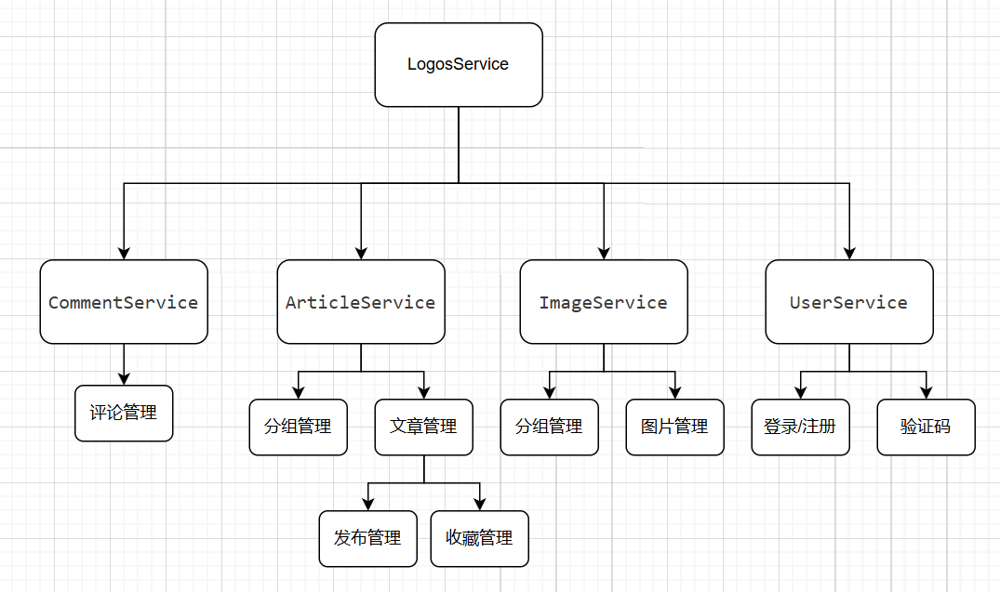

# logos
简洁的MD文档网

## 后端技术详情及功能介绍
### 技术详情
本项目使用的技术如下：
- 微服务技术
  - SpringCloud
  - SpringCloudAlibaba
  - Nacos【服务注册与发现、配置文件共享与热更新】
  - Seata【微服务事务】
  - Gateway【网关、隐藏微服务与负载均衡】
  - OpenFeign【微服务通讯】
- 数据库技术
  - Mysql
  - Mybatis
  - MybatisPlus
- 缓存技术
  - Caffeine【JVM缓存】
  - Redis
- 其它
  - 阿里云短信服务【用于验证码】

### 功能介绍
该项目是微服务项目其具体服务分为：
- UserService 用户服务模块
  - 用户登录
  - 用户注册
  - 验证码发送
- ImageService 图片服务模块
  - 图片分组管理
  - 图片上传/删除
- ArticleService 文章服务模块
  - 用户发布文章分组管理
  - 用户收藏文章分组管理
  - 用户发布文章/修改文章
  - 文章管理
- CommentService 评论服务模块
  - 用户评论管理

如下图所示


## 前端技术详情与功能介绍
### 技术详情
本项目使用技术如下
- vue3
- Router【路由】
- Store【状态存储】
- Axios【Ajax请求】
- ElenemtPlus【UI】
- vue-waterfall【图片显示瀑布流】
- animate【动画】
### 功能介绍
- UserModel
  - login/register 【登录/注册】
  - groupManager   【图片/文章/收藏 分组管理】
  - info           【用户详情】
  - edit           【用户修改】
- ArticleModel
  - publish        【显示用户发布的文章】
  - collector      【收藏文章】
  - rewrite        【重写/编辑 文章】
  - write          【写文章/发布文章】
  - comment        【显示评论】
- ImageModel
  - del/upload     【删除/上传文章】

## 项目部署
### 部署前端
我们使用 docker 部署 Nginx 具体操作如下
```sh
# 1.拉取 nginx 镜像
docker pull nginx

# 2.执行下列语句
mkdir /root/nginx
mkdir /root/nginx/conf
mkdir /root/nginx/conf.d
mkdir /root/nginx/html
mkdir /root/nginx/log
mkdir /root/nginx/html/images
```
然后在 /root/nginx/conf 目录下创建 nginx.conf 文件，内容如下
```conf
#user  nobody;
worker_processes  1;

events {
    worker_connections  1024;
}

http {
    include       mime.types;
    default_type  application/octet-stream;

    sendfile        on;
    #tcp_nopush     on;
    keepalive_timeout  65;

    include /etc/nginx/conf.d/*.conf;
}
```
继续在 /root/nginx/conf.d 目录下创建 default.conf 文件，内容如下
```conf
upstream gateway_servers {
    server <替换为你自己的服务器IP>:8081;
}

server {
    listen       80;
    server_name  <替换为你自己的服务器IP>;

    #允许跨域请求的域，* 代表所有
    add_header 'Access-Control-Allow-Origin' *;
    #允许带上cookie请求
    add_header 'Access-Control-Allow-Credentials' 'true';
    #允许请求的方法，比如 GET/POST/PUT/DELETE
    add_header 'Access-Control-Allow-Methods' *;
    #允许请求的header
    add_header 'Access-Control-Allow-Headers' *;

    location / {
        root   /usr/share/nginx/html;
        index  /index/index.html /index/index.htm;
        try_files $uri $uri/ /index.html;
    }
    
    location /api {
        proxy_pass http://gateway_servers;
        proxy_set_header Host $host;
        proxy_set_header X-Real-IP $remote_addr;
    }

    error_page   500 502 503 504  /50x.html;
    location = /50x.html {
        root   /usr/share/nginx/html;
    }
}
```
然后根据 nginx 镜像创建容器
```sh
docker run --name nginx -d -p 80:80 
  -v /root/nginx/log:/var/log/nginx  
  -v /root/nginx/conf/nginx.conf:/etc/nginx/nginx.conf
  -v /root/nginx/conf.d:/etc/nginx/conf.d 
  -v /root/nginx/html:/usr/share/nginx/html
  nginx
```
最后将 vue 项目打包将 dist 下的所有文件放到 /root/nginx/html 下
### 后端部署
首先创建网络
```sh
docker network create logos-net
```
再使用 docker 部署 mysql
```sh
docker run \
--name mysql  \ 
-e MYSQL_ROOT_PASSWORD=123 \
-p 3306:3306  \
--network logos-net \
-d mysql:8  \
```
再使用 docker 部署 nacos
```sh
# 先创建目录
mkdir /root/nacos
```
然后在 /root/nacos 下创建文件 custom.env 内容如下
```env
# 注意：Nacos 需要 Mysql，可以百度 Nacos 的 Mysql 数据库
PREFER_HOST_MODE=hostname
MODE=standalone
SPRING_DATASOURCE_PLATFORM=mysql
MYSQL_SERVICE_HOST=172.30.26.90
MYSQL_SERVICE_DB_NAME=nacos
MYSQL_SERVICE_PORT=3306
MYSQL_SERVICE_USER=root
MYSQL_SERVICE_PASSWORD=123
MYSQL_SERVICE_DB_PARAM=characterEncoding=utf8&connectTimeout=1000&socketTimeout=3000&autoReconnect=true&useSSL=false&allowPublicKeyRetrieval=true&serverTimezone=Asia/Shanghai
```
然后再创建 nacos 容器
```sh
docker run -d \
--name nacos \
--env-file /root/nacos/custom.env \            # 这里是nacos的配置文件
-p 8848:8848 \
-p 9848:9848 \
-p 9849:9849 \
--network logos-net \
--restart=always \
nacos/nacos-server:v2.1.0-slim
```
最后创建目录 /root/seata 再在下面创建文件 application.yml 内容如下
```yml
server:
  port: 7099
spring:
  application:
    name: seata-server
logging:
  config: classpath:logback-spring.xml
  file:
    path: ${user.home}/logs/seata
console:
  user:
    username: admin
    password: admin
seata:
  config:
    type: file
  registry:
    type: nacos
    nacos:
      application: seata-server
      server-addr: nacos:8848
      group : "DEFAULT_GROUP"
      namespace: ""
      username: "nacos"
      password: "nacos12138"
  security:
    secretKey: SeataSecretKey0c382ef121d778043159209298fd40bf3850a017
    tokenValidityInMilliseconds: 1800000
    ignore:
      urls: /,/**/*.css,/**/*.js,/**/*.html,/**/*.map,/**/*.svg,/**/*.png,/**/*.ico,/console-fe/public/**,/api/v1/auth/login
  server:
    max-commit-retry-timeout: -1
    max-rollback-retry-timeout: -1
    rollback-retry-timeout-unlock-enable: false
    enable-check-auth: true
    enable-parallel-request-handle: true
    retry-dead-threshold: 130000
    xaer-nota-retry-timeout: 60000
    enableParallelRequestHandle: true
    recovery:
      committing-retry-period: 1000
      async-committing-retry-period: 1000
      rollbacking-retry-period: 1000
      timeout-retry-period: 1000
    undo:
      log-save-days: 7
      log-delete-period: 86400000
    session:
      branch-async-queue-size: 5000 
      enable-branch-async-remove: false 
  store:
    mode: db
    session:
      mode: db
    lock:
      mode: db
    db:
      datasource: druid
      db-type: mysql
      driver-class-name: com.mysql.cj.jdbc.Driver
      url: jdbc:mysql://mysql:3306/seata?rewriteBatchedStatements=true&serverTimezone=UTC
      user: root
      password: 123
      min-conn: 10
      max-conn: 100
      global-table: global_table
      branch-table: branch_table
      lock-table: lock_table
      distributed-lock-table: distributed_lock
      query-limit: 1000
      max-wait: 5000
  metrics:
    enabled: false
    registry-type: compact
    exporter-list: prometheus
    exporter-prometheus-port: 9898
  transport:
    rpc-tc-request-timeout: 15000
    enable-tc-server-batch-send-response: false
    shutdown:
      wait: 3
    thread-factory:
      boss-thread-prefix: NettyBoss
      worker-thread-prefix: NettyServerNIOWorker
      boss-thread-size: 1
```
使用 docker 创建 seata 镜像
```sh
docker run --name seata \
-p 8099:8099 \
-p 7099:7099 \
-v /root/seata:/seata-server/resources \
--privileged=true \
--network logos-net \
-d \
seataio/seata-server:1.5.2
```
最后将项目打成 jar 包然后使用下列方法执行，也可以使用 docker 进行部署，不过我偷懒了
```sh
# 启动网关
nohup java -Xms64m -Xmx128m -jar GatewayService.jar --spring.cloud.nacos.server-addr=127.0.0.1:8848 &

# 启动用户服务
nohup java -Xms64m -Xmx128m -jar UserService.jar --spring.cloud.nacos.server-addr=127.0.0.1:8848 &

# 启动图片服务
nohup java -Xms64m -Xmx128m -jar ImageService.jar --spring.cloud.nacos.server-addr=127.0.0.1:8848 &

# 启动文章服务
nohup java -Xms64m -Xmx128m -jar ArticleService.jar --spring.cloud.nacos.server-addr=127.0.0.1:8848 &

# 启动评论服务器 
nohup java -Xms64m -Xmx128m -jar CommentService.jar --spring.cloud.nacos.server-addr=127.0.0.1:8848 &
```
## 项目展示
项目地址：http://8.134.56.250/home

## 最后
感谢一下 B 站的黑马老师们！！！